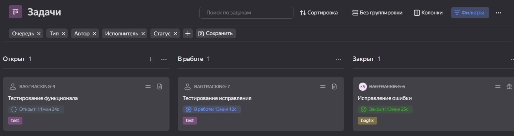
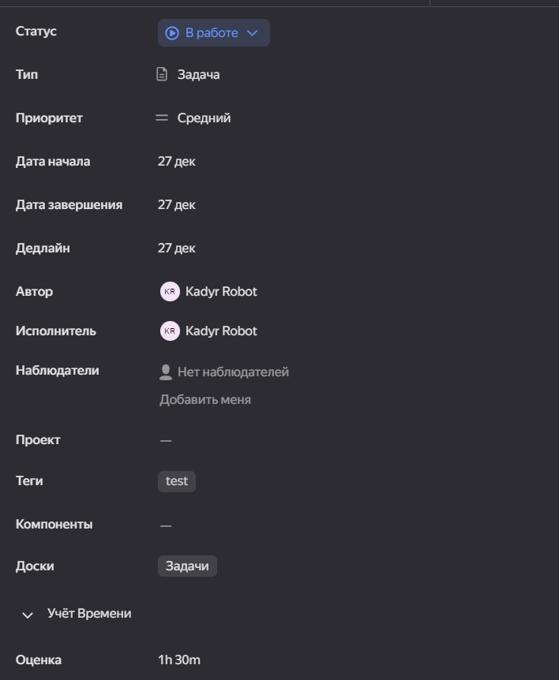

# Управление проектами

### Задачи

Нужно с помощью программами управления проектами(Github project, Yandex tracker, redmine) создать проект и добавить в него задачи разного типа.

### Решение

У нас в доске задач три типа задач, где при открытии задачи добавляется в колонку "открыт". Мы можем менять статусы задач, можем статус первести в "в работе". Если задача выполнена переводим в колонку закрыт. Еще у нас есть состояние "Требуется информация".  

При создании задачи мы може задать его параметры. Мы можем менять статус задачи, можем настроить прироритет задачи. Еще мы можем установить дату создании, дедлайн нашей задачи. Мы можем поставитить исполнителя и наблюдателя, и можем поставить теги для удобного поиска задачи. Еще мы можем поставить учет времени. 

